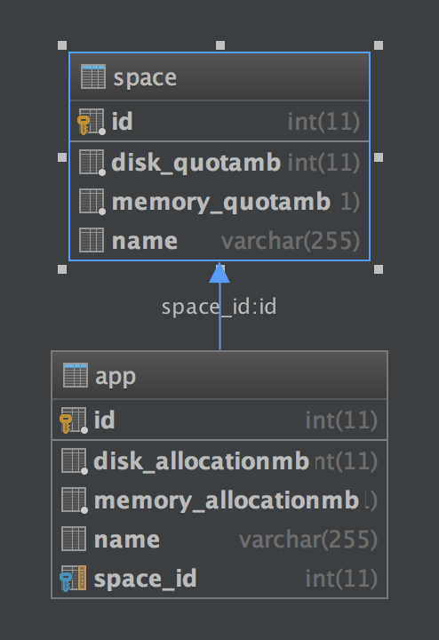

# Sunshine Forge

## Background

You have been hired as a developer at Sunshine Forge - a young startup that intends to compete with Cloud Foundry.

In your new role, you are expected to work with your pair and develop an API using Spring Boot and MySQL.

Sunshine Forge will work much like Cloud Foundry: the main entity in the data model is an App. Developers will write apps and push them to Sunshine Forge for hosting. Since one company might have many Apps, each app will be contained in a Space:                     

Customers will be billed for spaces based upon the amount of resources they are allocated:

1. Hard drive space
1. Memory

Each app will declare the amount of disk and memory that it will consume. If clients exceed the quotas they've purchased, they should not be allowed to push apps until they buy more. For this assignment you can ignore the actual billing requirements, only the quotas will need to be enforced.

Since you are building an API, your primary users will be the front-end team which will consume your API. Several stories have come out of the inception.

*** As usual write tests first, and be sure to switch drivers! ***

### Epic #1: Spaces

1. As an API consumer, I would like to make an HTTP POST to create a Space
1. As an API consumer, I would like to make an HTTP GET request to list all Spaces
1. As an API consumer, I would like to make an HTTP GET request to get details of a single Space
1. As an API consumer, I would like to make an HTTP PUT request to update the details of a Space
1. As an API consumer, I would like to make an HTTP DELETE request to delete a Space

### Epic #2: Apps

1. As an API consumer, I would like to make an HTTP POST to create an App within a given Space
1. As an API consumer, I would like to make an HTTP GET request to list all Apps in a Space
1. As an API consumer, I would like to make an HTTP GET request to get details of a single App
1. As an API consumer, I would like to make an HTTP PUT request to update the details of an App
1. As an API consumer, I would like to make an HTTP DELETE request to delete an App
1. As an API consumer, given that I POST an App that exceeds the resource limits of the Space, I should receive a [403 Error](http://softwareengineering.stackexchange.com/questions/288376/recommended-http-status-code-for-plan-limit-exceeded-response) with a JSON body explaining which limit has been exceeded.

### Epic #3: Stretch
1. As an API consumer, I would like the server to prevent users from accessing each others Spaces and Apps using [Basic Authentication](http://websystique.com/spring-security/secure-spring-rest-api-using-basic-authentication/)

## Reflection

Stop coding approximately 15 minutes before the end of the exercise and have a discussion with your pair.

Some questions to answer as a pair:

1. How do Spring Boot make the job easier?
1. In what ways did you struggle with Spring?
1. What errors did you encounter?
1. What were the most effective techniques you used to debug those errors?
1. How did you perform as a pair? Which pairing techniques worked best?
1. Is there anything you would have done differently if you had to do this activity again?
